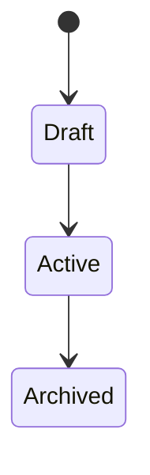

# Spec Creator

新機能の仕様書を `docs/spec/` 配下に作成する汎用スキル。

## 原則

**仕様書は「何を作るか」を書く場所。「どう作るか」は書かない。**

- ✅ 機能の目的、ユーザー価値
- ✅ 用語定義、エンティティ概念
- ✅ 振る舞い（入力・出力・状態遷移）
- ✅ ビジネスルール・制約
- ✅ エラー・境界条件
- ❌ 具体的な実装言語・フレームワーク
- ❌ ファイルパス、クラス名、関数名
- ❌ DB スキーマの具体的な型・テーブル名
- ❌ API のエンドポイント URL やステータスコードの詳細

仕様書は実装言語を変えても有効である、というのが指標。

## 実行手順

### 1. 必要情報の確認

ユーザーに以下を順番に確認（不明なら質問。自明なら省略）:

- **機能名**: 仕様書ファイル名の元になる（kebab-case）
- **目的 / ユーザー価値**: なぜこれが必要か
- **スコープ**: 今回含める範囲 / 含めない範囲
- **前提**: 既に決まっていること（UI デザイン、外部仕様、他機能との関係）
- **既存仕様との関係**: 更新か新規か

### 2. 配置先の決定

```
docs/spec/
├── <feature-name>-spec.md          シンプルな機能
└── <domain>/                        大きな領域は配下にまとめる
    ├── <sub-feature>-spec.md
    └── overview.md
```

命名規則:
- ファイル名は `<name>-spec.md`
- 領域が広い場合はディレクトリを切る

既存の `docs/spec/` 構成を確認して、慣習に合わせる。

### 3. テンプレート

```markdown
# <機能名> 仕様

## 1. 概要

### 目的
<なぜこの機能が必要か。ユーザー / ビジネス価値。>

### スコープ
- 含む: <箇条書き>
- 含まない: <箇条書き>

## 2. 用語定義

| 用語 | 定義 |
| --- | --- |
| <term> | <意味> |

## 3. 主要な振る舞い

### 3.1 <ユースケース名>

- **トリガー**: <いつ起きるか>
- **入力**: <必要な情報>
- **処理の流れ**:
  1. ...
  2. ...
- **結果**: <成功時の状態変化 / 出力>
- **関連ルール**: [4. ビジネスルール](#4-ビジネスルール) の R-XX

### 3.2 ...

## 4. ビジネスルール

- **R-01**: <ルール本文>
- **R-02**: <ルール本文>

各ルールには一意な ID を振る（後から実装・テストで参照できるように）。

## 5. 状態・ライフサイクル

<該当する場合のみ。Mermaid stateDiagram 推奨>



## 6. エラー・境界条件

| 条件 | 振る舞い |
| --- | --- |
| <条件> | <期待される振る舞い> |

## 7. 非機能要件

<該当する場合のみ: パフォーマンス、セキュリティ、可用性>

## 8. オープン課題

- [ ] <未決定事項>
- [ ] ...

## 9. 参考資料

- <関連する仕様書、外部仕様、議事録>
```

### 4. 書くときの注意

- **ルール ID を必ず振る**。後続の実装・テスト・レビューで参照する
- **例を入れる**。抽象的な説明だけだと誤解される
- **「こうあるべき」ではなく「こうである」で書く**。仕様は決定事項
- **未決定は明示的に「未決定」と書く**。埋めるために推測しない
- **実装者への指示を書かない**（「～を実装すること」という文体は避ける）

### 5. 生成後の確認

- ユーザーに内容を提示して承認を得る
- 特に「オープン課題」セクションの扱い（空にすべきか、明示的に列挙すべきか）を確認
- 承認後に `docs/spec/` に書き込む

## いつ使わないか

- 既存仕様の軽微な修正 → `backend-spec-updater` を使う
- 実装計画書を書きたい → `backend-work-planner` を使う
- デバッグや調査 → 別スキル

## 関連

- [backend-spec-updater](../backend-spec-updater/SKILL.md) — 既存仕様の更新
- [backend-work-planner](../backend-work-planner/SKILL.md) — 仕様を元に実装計画書を作成
